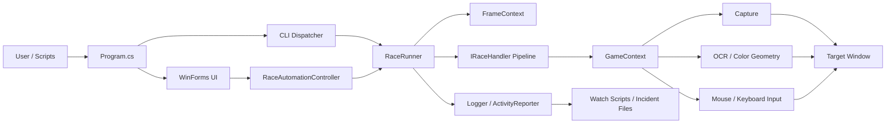

# SleepRunner Architecture

## 概述

SleepRunner 是一个 Windows 桌面自动化项目。系统通过截图、OCR、固定区域、颜色/几何判断和输入模拟驱动目标窗口，核心目标不是“全场景万能脚本”，而是建立一套可扩展、可调试、可长期维护的自动化架构。

当前主线能力聚焦于跑马流程，包括：

- 主菜单分流
- 事件选择
- 训练决策
- 交易与委托链路
- 战斗内 AUTO 维护
- 基础监督与诊断

## 设计原则

- 单一自动化核心：GUI 与 CLI 共用同一套业务实现
- 页面优先：按页面 Handler 拆分，而不是维护超大状态机
- 单帧复用：OCR 在同一帧内只计算一次
- 配置数据化：事件、卡片、交易、训练策略由 JSON profile 驱动
- 诊断优先：日志、快照、监督脚本是架构的一部分，而不是事后补丁

## 系统总览



## 运行时流程

1. `Program.cs` 根据参数决定进入 GUI 或 CLI。
2. GUI 通过 `RaceAutomationController` 管理生命周期；CLI 直接创建并运行 `RaceRunner`。
3. `RaceRunner` 在循环中截图，并为当前帧创建 `FrameContext`。
4. 所有 Handler 按 `Priority` 升序判定，首个命中的 Handler 获得执行权。
5. Handler 通过 `DescribeDecision()` 生成可读决策，再由 `HandleAsync()` 执行动作。
6. 实际截图、等待、坐标点击、热键发送都统一经由 `GameContext`。
7. 日志、活动状态、快照与监督脚本共同构成运行期可观测性。

## 核心模块

| 模块 | 责任 |
| --- | --- |
| `src/Program.cs` | GUI / CLI 入口路由、日志会话初始化 |
| `src/Forms/` | WinForms 控制台、参数调节、profile 切换、状态展示 |
| `src/Cli/` | CLI 命令注册、公共启动逻辑、专项调试命令 |
| `src/Automation/` | 自动化上下文、控制器、任务抽象 |
| `src/Automation/Race/` | 跑马核心域：主循环、Handler 接口、运行配置、step gate |
| `src/Automation/Race/Policy/Training/` | 训练规则引擎、规则卡、上下文与结果模型 |
| `src/Vision/` | 单帧 OCR 缓存 |
| `src/Recognition/` | Windows OCR |
| `src/Capture/` | 基于 Win32 GDI 的窗口截图 |
| `src/Input/` | 鼠标与键盘输入模拟 |
| `src/Utils/` | 路径、日志、窗口查找、用户设置 |
| `src/Supervision/` | 快照服务与监督辅助能力 |

## Race Handler Pipeline

当前跑马主循环注册以下 Handler：

| Priority | Handler | 责任 |
| --- | --- | --- |
| 0 | `SkipHandler` | 处理通用 SKIP 按钮 |
| 2 | `OverlayMenuHandler` | 关闭覆盖层、暂停层等通用浮层 |
| 4 | `MovePlatformHandler` | 月台 / 地区移动分支 |
| 5 | `EventHandler` | 事件页检测、事件目录匹配、选项执行 |
| 10 | `CardSelectHandler` | 卡片选择页 |
| 12 | `BattleHandler` | 战斗中 AUTO 开关维护 |
| 13 | `AppraiseAcceptHandler` | 评鉴战接受页 |
| 13 | `BattleDefeatHandler` | 战斗失败后的重试链路 |
| 14 | `BattleLeaveHandler` | 战斗结算退出 |
| 14 | `CommissionHandler` | 委托列表、委托弹窗与跳过逻辑 |
| 15 | `TrainingSelectHandler` | 全量训练扫描、隔离规则引擎、训练或休息执行 |
| 16 | `TradeAndAppraiseHandler` | 交易 / 委托分流页路由 |
| 17 | `TradePurchaseHandler` | 交易详情识别与购买 |
| 18 | `RestDecisionHandler` | 休息页预算决策与点击 |
| 19 | `JourneyEndHandler` | 旅程结束收口 |
| 20 | `MainMenuHandler` | 主菜单训练 / 委托 / 休息分流 |

### Handler 拆分约定

复杂页面不再维持单文件大类，主 Handler 只负责编排，细节下沉到子模块：

- `XxxScreenChecks`：页面指纹与识别条件
- `XxxOcrRegions`：OCR 区域与文本归一化
- `XxxGeometry`：点击坐标与几何推导
- `XxxPolicy`：纯决策逻辑
- `XxxActions` / `XxxFlowExecutor`：异步流程编排

这种拆分方式已经在事件、训练、交易、委托和战斗链路中落地。

## 配置与数据模型

### 源码资产

| 路径 | 作用 |
| --- | --- |
| `assets/events/` | 事件决策 profile |
| `assets/cards/` | 卡片优先级与白名单 profile |
| `assets/trade/` | 交易关键词 profile |
| `assets/training/` | 训练 rule cards profile |

### 运行时文件

运行时路径统一以可执行文件目录为根，通过 `PathHelper` 解析。构建后，资产会复制到输出目录，例如：

```text
src/bin/x64/Debug/net8.0-windows10.0.17763.0/assets/
```

常见运行时文件：

| 路径 | 作用 |
| --- | --- |
| `assets/config/user_settings.json` | 用户参数与窗口状态持久化 |
| `assets/logs/latest.log` | 当前最新日志 |
| `assets/logs/<session>.log` | 独立会话日志 |
| `assets/supervision/` | 监督脚本、快照、incident 数据 |

### Profile 选择

运行时 profile 由对应的 profile manager 管理并持久化到 `user_settings.json`。其中训练 profile 由 `TrainingRuleProfileManager` 负责，事件、卡片和交易则分别由各自的 profile manager 管理。  
事件、卡片、交易、训练四类策略相互独立，便于按 build 方向或实验策略切换。

## GUI 与 CLI

### GUI

`RaceMainWindow` 提供：

- 启动 / 停止
- 运行状态展示
- 失败率、等待倍率、点击倍率、build 方向等参数调节
- profile 切换
- 配置持久化

### CLI

CLI 提供两类能力：

- 运行类：`--race`、`--race-auto`、`--race-step`、`--race-decide-once`
- 调试类：`--test`、`--snapshot`、`--ocr`、`--debug-trade`、`--probe-*`

CLI 与 GUI 共用同一个自动化核心，因此调试结果可以直接用于定位真实运行中的问题。

## 监督与诊断

监督能力由三个部分构成：

- `Logger`：会话日志与 `latest.log`
- `SnapshotService`：手动或脚本触发的截图能力
- `scripts/watch-race.ps1`：外部 watchdog，监控日志推进、重复决策和快照

当前监督策略是“保守诊断优先”，以留档和复盘为主，不主动对游戏做激进恢复。

## 扩展方式

### 新增页面 Handler

1. 在 `src/Automation/Race/Handlers/` 新增 Handler。
2. 如页面复杂，按 `ScreenChecks / OcrRegions / Geometry / Policy / Actions` 拆分子模块。
3. 在 `RaceRunner` 中注册，并为其分配合适的 `Priority`。
4. 使用 CLI 探针验证 `CanHandle()` 与 `DescribeDecision()`。

### 新增策略

1. 在 `assets/events`、`assets/cards`、`assets/trade` 或 `assets/training` 添加新的 JSON profile。
2. 通过 UI 或运行时设置切换 profile。
3. 若是新字段或新规则，需要同步更新对应 `Policy` 解析逻辑。

### 新增 CLI 命令

1. 在 `src/Cli/Commands/` 实现 `ICliCommand`。
2. 在 `CliDispatcher.CreateDefault()` 注册命令。
3. 若命令不应写入持久日志，可实现 `IEphemeralCliCommand`。

## 约束与非目标

- 当前仅支持 Windows
- 当前实现依赖真实窗口截图和 OCR，不追求“任意分辨率零调参”
- 项目不是通用自动化平台，也不是游戏内注入工具
- 当前没有自动化测试体系，验证主要依赖构建、专项 CLI 与实机日志

